# Installing Intellij IDEA
I already had Intellij installed for many years now, but here are the installation instructions: 
* Download the Community Version from this [link](https://www.jetbrains.com/idea/download/#section=windows)
* Once downloaded, run the installer and follow the prompts
* Later there are several optimizations you can make and themes you can change
* After following all these steps you should have something similar to the below image:
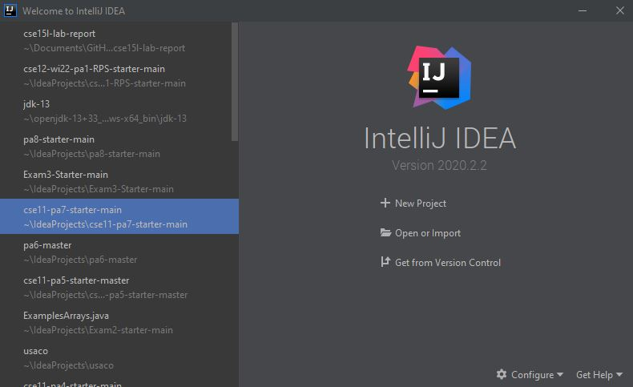  
 
* Note: your image will look different based on your theme, mine is dark themed. Furthermore you won't have all the projects on the side, that is your recently opened projects history. This will probably be blank if it is your first time using the program.       
 
# Remotely Connecting
Using the IDE, we can connect to and work on a remote computer through the internet. The first step is to download OpenSSH by following the instructions in this [link.](https://docs.microsoft.com/en-us/windows-server/administration/openssh/openssh_install_firstuse)
Then you can find your course account, by putting your Active Directory Login into this website [https://sdacs.ucsd.edu/~icc/index.php](https://sdacs.ucsd.edu/~icc/index.php).
The page will look something like this, with your course account for CSE15L being the one with the red arrow pointing to it. Yours will look mostly identical, and the crossed out part will contain letters that correspond to your unique account.
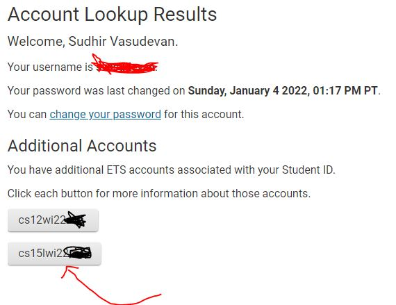   
 
Once retrieving your account info, open terminal on Intellij by clicking the "Terminal" button on the bottom left of the screen. 
Type in the command "ssh " followed by your account that you found in the last step concatenated with "@ieng6.ucsd.edu". 
> Should be in a similar form to `ssh cs15lwi22zz@ieng6.ucsd.edu`.
>
If this is your first time connecting, you should get a prompt that asks "Are you sure you want to continue connecting (yes/no/[fingerprint])?", respond yes as it is an expected message. 
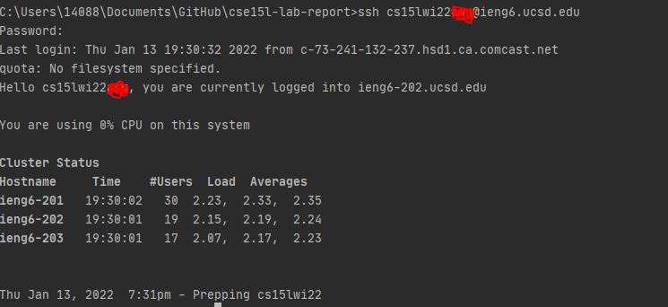    
 
If it shows a similar message to the above image, your terminal(_client_) is successfully connected to the CSE basement computer(_server_).     
 
# Trying Some Commands
Once connected, you can try to run some commands such as `cd`, `ls`, `pwd`, `mkdir`, `cp`. Some examples of me running those commands are below:
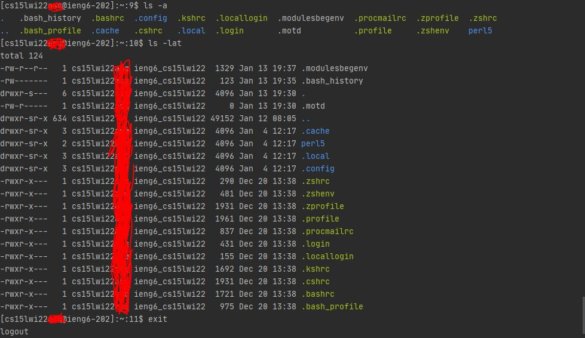    
 
# Moving Files with scp
It is possible to copy files to a remote computer using the command `scp`. To test, first create a file called `WhereAmI.java` with the below contents:
>class WhereAmI {
   public static void main(String[] args) {
     System.out.println(System.getProperty("os.name"));
     System.out.println(System.getProperty("user.name"));
     System.out.println(System.getProperty("user.home"));
     System.out.println(System.getProperty("user.dir"));
   }
 }
>
Using standard `javac` and `java` commands, run the file locally on **your** terminal. You should get an output similar in this format, obviously varying with which OS you are using, your name and file path.
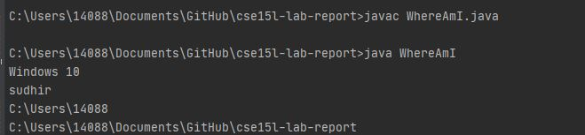    
 
Then run this command, again substituting your specific letter combination for the "zz"
>`scp WhereAmI.java cs15lwi22zz@ieng6.ucsd.edu:~/`
>
You should be prompted for your password, put that in. Now log into ieng6 with the prior ssh command and use the command `ls`. Since `ls` lists the files in the directory you should now see WhereAmI.java. Verifying that try running the java file on the ieng6 computer with the usual `javac`, `java` commands.
Now the file path, name and OS will be different according to that of the ieng6 computer in the CSE basement.
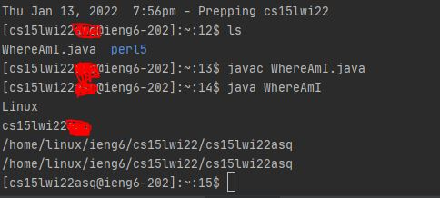    
 
# Setting an SSH Key
There is a better alternative to typing your password everytime you login, as you may have guessed by the title, SSH keys! A program called `ssh-keygen` generates a public and private key, then you copy the public key to a server location and the private key to a client location. Then ssh command can use these pair of files instead of your password to log you in. To set this up, run the command `ssh-keygen` on your computer.
Then follow the prompts to set a path and a passcode, as you desire. 
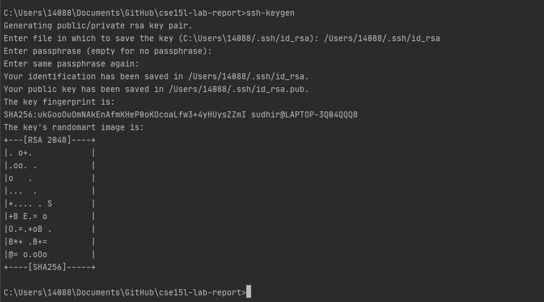    
 
Then if you are on Windows OS, Run powershell as administrator(rightclick on powershell and this should be an option)
Now run the following commands and you should get similar responses as I have gotten below:
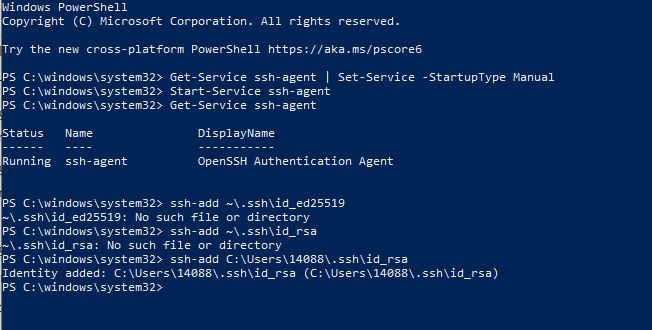   
 
These last commands are to securely store the private keys within the context of Windows security.
Now we want to copy the public key over to the .ssh directory on the server's user account. However the directory .ssh doesn't exist yet so we have to make it first. 
To achieve the above, first log on to the ieng6 computer using the ssh command we used above, run `mkdir .ssh`, logout using the `exit` command, then use the command 'scp /Users/name/.ssh/id_rsa.pub cs15lwi22zz@ieng6.ucsd.edu:~/.ssh/authorized_keys' with your user name and path to copy the public key to the .ssh directory of the user account on the server.
Now try running ssh or scp and note how much easier it is.
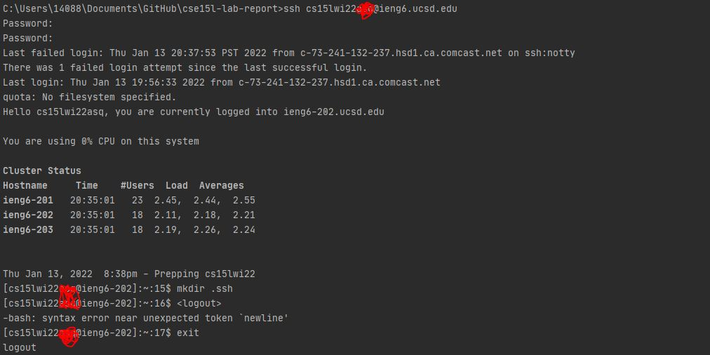
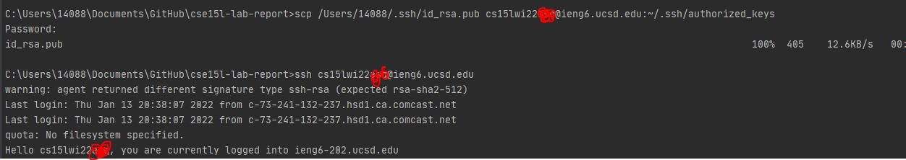     
 
# Optimizing Remote Running
Then using the information we have learned from the previous steps we can try to optimize making a local edit to WhereAmI.java, then copying it to the remote server and running it.
Some other optimization techniques include:
>- Writing a command in quotes at the end of a ssh command to immediately run it then logout
>-  `ssh cs15lwi22@ieng6.ucsd.edu "ls"`
>- Using semicolons to run multiple commands on the same line
>- cp WhereAmI.java OtherMain.java; javac OtherMain.java; java WhereAmI
>- You can use the up and down arrows to recall the last few commands run. 
Using these tricks we can first make any random edit on the WhereAmI.java, my edit is going to be adding the line `System.out.println("optimized")` at the top
Then I am going to use the scp command to copy the file over. Then using the semicolon trick I am going to on the same line, log into my account and using the quotation trick, compile and run the WhereAmI file.
Here is how it looks like: 
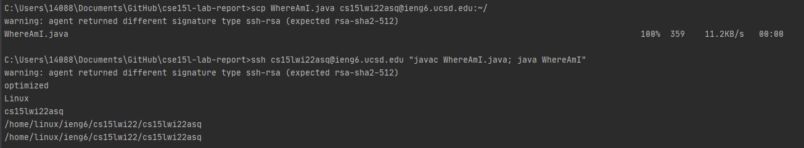      
> 
Feel free to experiment with different methods, as well.

That's all for this time! 